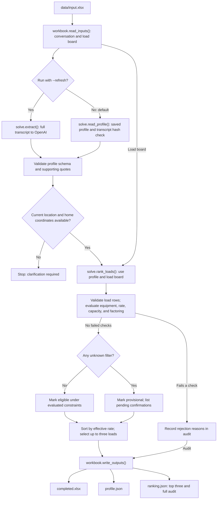

# Cinesis load matcher

## Problem

Extract driver requirements and rank three candidate loads using the confirmed constraints:

`effective $/mile = price / (Dallas → pickup + pickup → delivery + delivery → San Antonio)`

## Solution

OpenAI extracts fields with quotes. Python validates evidence, uses board coordinates and haversine miles, then applies every constraint supported by the available data before ranking.

Capacity is **unknown**. The results rank loads that match the known equipment and rate constraints, then label them provisional until payload capacity and factoring approval are confirmed. Exclude generic Flatbed. L06/L07 lack data. L05 earns $2.514/mile but is rejected because its Flatbed label does not match the extracted Hotshot/Gooseneck equipment; confirm compatibility.

## Check results

| Rank | Load | $/mile |
|---|---|---:|
| 1 | L03 | 3.098 |
| 2 | L08 | 2.480 |
| 3 | L02 | 2.418 |

Inspect the [completed workbook](results/completed.xlsx), [live extraction/evidence](results/profile.json), and [distances/rejection reasons](results/ranking.json).

## Reproduce

Requires Python 3.11+/uv:

```sh
uv sync --extra dev
uv run python solve.py
uv run pytest -q
```

Replays the saved profile without API calls into `outputs/`. Capacity remains unknown, so the program returns provisional candidates.

For fresh extraction:

```sh
uv run python security.py --set-key
uv run python solve.py --refresh
```

Keys stay in owner-only, Git-ignored `.env`. Before publishing:

```sh
uv run python security.py --check
```

The submission workbook includes the public repository link: https://github.com/vincewu51/cinesis-load-matcher.

## How each component works



Effective rate includes travel to pickup, delivery, and the return home. Factoring approval remains an unresolved check because broker information is absent from the board.

### `solve.py` — command-line entry point, extraction, and ranking

This is the main program. `main()` reads the input workbook, loads or extracts a driver profile, ranks the loads, and calls `workbook.write_outputs()` to save the results.

- **Data models:** `DriverProfile`, `Claim`, `Evidence`, and `Rate` define the structured response using Pydantic. Each populated claim requires supporting evidence; unknown values use `null`.
- **Extraction:** `PROMPT` defines the extraction rules. `extract()` sends the full transcript in one OpenAI request and returns the profile with model, timestamp, prompt hash, and transcript hash. `validate_evidence()` checks that each quote occurs in its cited row after whitespace normalization. This verifies the quote's source, not whether its interpretation is correct.
- **Replay:** `read_profile()` loads a saved profile, checks its schema version and transcript hash, and validates its evidence. This is the default path; `--refresh` requests a new extraction.
- **Ranking:** `rank_loads()` validates load fields and records `pass`, `fail`, or `unknown` for each equipment, minimum-rate, capacity, and factoring check. Any failure rejects the load; otherwise any unknown makes it provisional. Each audit row includes `checks` with explanations and `pending_confirmations`. New filters can use the same check structure without changing how final status is decided. `haversine()` calculates pickup, delivery, and return-home distances. Results are sorted by unrounded effective rate, with load ID as the tie-breaker. The return value contains `top_three`, a per-load `audit`, and unresolved requirements.

Unknown equipment, minimum rate, capacity, or factoring requirements produce provisional candidates. Factoring approval also stays unknown because the board lacks broker information. Missing current location or home base prevents calculation of total mileage and stops ranking with a validation error. Critical missing load data is still excluded; geographic preferences remain soft rather than hard filters. CLI options are `--input`, `--profile`, `--output`, `--refresh`, `--model`, and `--repo-url`.

### `workbook.py` — workbook input and result output

This module handles Excel and JSON files for the main program.

- `read_inputs()` reads the conversation as speaker/dialogue/row records and the load board as dictionaries. It checks the expected load-board headers.
- `transcript_hash()` fingerprints the conversation for profile replay. `normalize_city()` and `city_coordinates()` match extracted city names to one unambiguous coordinate pair on the board.
- `submission_note()` builds the take-home answer for the spreadsheet README.
- `fill_workbook()` patches answer-sheet XML inside the XLSX archive, preserving other archive contents and refusing to overwrite the input workbook.
- `write_outputs()` fills Part A, Part B, and the note in A11:C14; enforces the 200-word note limit; and writes `completed.xlsx`, `profile.json`, and `ranking.json` to the output directory.

### `security.py` — local credentials and publication checks

`save_key()` implements `--set-key`: it accepts a hidden terminal input and writes the key to an owner-only `.env` file, which Git ignores. `check_secrets()` implements `--check`: it scans the Git index, including embedded XLSX contents, using `contains_secret()`. The scanner checks credential patterns and the configured API key without printing matched secrets. It checks the staged snapshot, not Git history or unstaged edits.

### `test_solver.py` — automated checks

The pytest suite uses the input workbook and saved profile as fixtures. It covers distance calculations, rate boundaries, capacity filtering, malformed loads, duplicate IDs, evidence validation, saved-profile fingerprints, workbook preservation, and secret detection. OpenAI responses are mocked, so tests make no live API calls. Generated test files are written to temporary directories.

## Next steps

1. **Manage prompts by scenario.** Add a prompt manager to select and version prompts for different locations, companies, and dispatch policies. Keep a shared extraction schema so the ranking logic can use the same structured output across scenarios.

2. **Ask for missing information during live dispatch.** Move profile extraction and requirement checks into the live AI dispatcher. When critical information is missing, the dispatcher can proactively ask the driver a focused follow-up question, update the profile, and rerun the ranking before recommending a load.

3. **Optimize assignments across multiple drivers.** Evaluate driver–load matches together rather than rank loads independently for each driver. Balance earnings, deadhead mileage, driver preferences, and fairness over time, while respecting eligibility and assigning each load only once. This would help distribute good opportunities more evenly across drivers.
